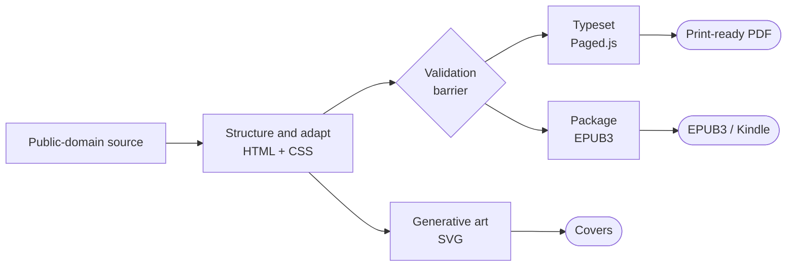

<p align="center">
  
</p>

<h1 align="center">Ética</h1>

<p align="center">
  <strong>A book production pipeline: public-domain text in, print-ready PDF and EPUB3 out.</strong>
</p>

<p align="center">
  
  
  
  
  
</p>

---

Typesetting a book normally means InDesign and a lot of manual layout. This does it
in code: HTML and CSS for the page, Python for the assembly, and a headless browser
as the typesetter.

It produces a print-ready 6×9 PDF with running heads and proper page breaks, a
hand-assembled EPUB3 that passes Kindle's converter, deterministic generative cover
art, and the same book in six languages from one build. The subject is Spinoza's
*Ethics* — the Elwes translation, Project Gutenberg #3800 — adapted into a modern
Portuguese edition.

## How it works



Nothing is written until the validation barrier passes. `src/_gates.py` sits between
the adapted text and every compiled artifact, and a failing gate stops the build
rather than shipping a book that drifted from its source.

## What it does

| | |
|---|---|
| **Typesetting** | Paged.js over `book.css` produces the print PDF: running heads, page breaks, apparatus |
| **EPUB3** | Hand-assembled OPF manifest and spine, NCX and `nav.xhtml`, `STORED` mimetype first in the zip. `epub_kindle.py` rasterises embedded SVGs so Amazon's KFX converter accepts the file |
| **Generative art** | Deterministic sacred-geometry SVGs on golden-ratio proportions — Spinoza's *ordine geometrico* made visible — plus a rendered cover per language |
| **Six languages** | One build parametrised by language code: PT, EN, ES, RU, ZH, JA, each with its own metadata, prose and localised in-image labels |
| **Web sample** | A self-contained single-file HTML reading sample |
| **KDP fallback** | EPUB to DOCX, the format Amazon recommends when its converter rejects an otherwise-valid EPUB |

## Quick start

Needs Python 3 and [Playwright](https://playwright.dev/python/) with Chromium:

```bash
pip install playwright && playwright install chromium

python src/gen_cover.py                    # build/cover.png
python src/build_sample_web.py             # the reading sample, single file
python src/build_pdf.py                    # assembles src/book-full.html
python src/render.py src/book-full.html build/etica-spinoza-2026.pdf
```

## Layout

```
src/        pipeline — build_pdf · build_epub · build_lang · build_site ·
            render · gen_art · gen_cover · epub_kindle · localize_svgs · _gates
src/parts/  the reading sample: preface, Part I, glossary, closing
assets/     generative SVG art and the mark
fontes/     public-domain source (Project Gutenberg #3800)
```

## License

Pipeline: [MIT](./LICENSE). Source text: public domain.

The adapted prose of the complete edition is a separate copyrighted work, published
on Kindle, and is not part of this repository.
