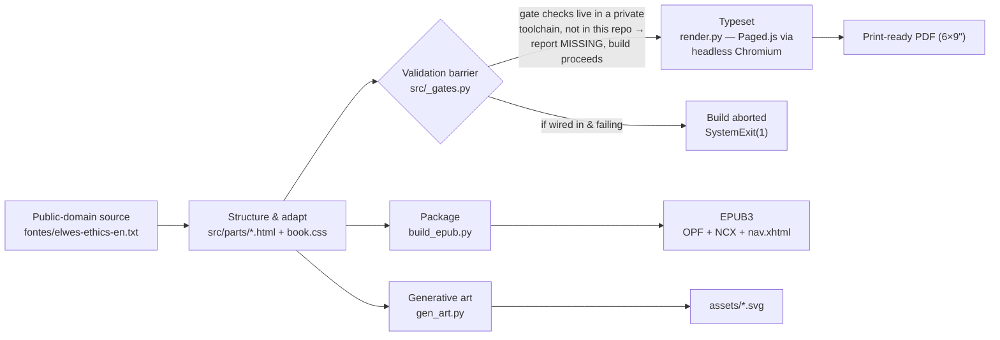

<p align="center">
  
</p>

# Ética — a multi-agent book production pipeline


**This repo is the engineering, not the book.**

An automated, agent-orchestrated pipeline that turns a public-domain source text
(the Elwes translation of Spinoza's *Ethics*, Project Gutenberg #3800) into a
modern, typeset book — print-ready PDF, EPUB3/Kindle, generative cover art, and a
multi-language build — with a validation barrier between the adapted text and any
compiled artifact. The full adapted prose is a separate commercial edition (on
Kindle); here you get the pipeline and a Part I sample, so the system is
inspectable end to end.

## How it works



`src/_gates.py` is the barrier `build_pdf.py` and `build_epub.py` call before
writing any artifact — see [Quality gates](#what-it-does) below for what it does
and doesn't do in this repo.

## At a glance

| | |
|---|---|
| **This repo** | The production pipeline — Paged.js print typesetting, hand-built EPUB3 packaging, generative SVG art, a six-language build engine, and the orchestrator half of a fidelity-gated validation barrier. |
| **Public here** | Pipeline code (`src/*.py`), templates/CSS, generative art (`assets/`), the public-domain source (`fontes/`), and a Part I reading sample (`src/parts/`). |
| **Not in this repo** | The complete adapted prose (Parts II–V), the translated (`i18n/`) editions, the compiled PDF/EPUB, and the gate *check* implementations — those are the paid product or live in a private companion tree. |

## What it does

- **Typesetting** — `build_pdf.py` + `render.py` drive Paged.js over `book.css`
  to produce a print-ready PDF (running heads, page breaks, apparatus).
- **EPUB/Kindle** — `build_epub.py` hand-assembles the reflowable EPUB3 (OPF
  manifest/spine, NCX + `nav.xhtml`, `STORED` mimetype as the first zip entry)
  from the same `src/parts/` fragments; `epub_kindle.py` rasterizes embedded SVGs
  so Amazon's KFX converter accepts the file; `build_fxl_epub.py` renders a
  fixed-layout, page-image EPUB straight from the PDF as an illustrated-book
  fallback.
- **Generative art** — `gen_art.py` generates the book's deterministic
  sacred-geometry SVG diagrams and part-openers into `assets/` (golden-ratio
  proportions, polygon rays — Spinoza's *ordine geometrico* made visible);
  `gen_cover.py` / `gen_covers.py` rasterize `cover.html` to a Kindle-size cover
  PNG per language via headless Chromium (Playwright); `localize_svgs.py`
  extracts and re-applies translated text for the SVGs that carry in-image
  labels.
- **Multi-language** — `build_lang.py` parametrizes the whole PDF+EPUB assembly
  by language code (PT/EN/ES/RU/ZH/JA), pulling metadata and prose from
  `i18n/<code>/` instead of the PT-only `book_meta.py` / `src/parts/`;
  `build_site.py` renders a multilingual sample+"buy" static site from the same
  language set; `make_kdp_guides.py` emits the KDP metadata guides per edition.
- **Quality gates** — `_gates.py` is the validation barrier `build_pdf.py` and
  `build_epub.py` call before writing any artifact (the "agent that says no").
  It's designed to run three checks — seal-coordinate existence, terminological
  drift vs. the glossary, and an LLM-judged semantic-fidelity pass. The check
  scripts themselves live in a private companion toolchain and are **not
  included** in this repo: on a fresh clone, every gate reports
  `MISSING (skipped)` and the build proceeds unblocked. What's open here is the
  barrier mechanism (`_gates.py`), not the checks it was built to enforce.
- **Web sample** — `build_sample_web.py` renders the public sample (Preface +
  Part I) as a self-contained single-file HTML page.
- **Preview & KDP fallback** — `shot.py` grabs a PNG screenshot per paginated
  page (via Paged.js/Playwright) for marketing previews; `epub_to_docx.py`
  converts a Kindle-safe EPUB to DOCX, the format KDP recommends when its KFX
  converter rejects an otherwise-valid EPUB.

## Run the sample

Requires Python 3 and [Playwright](https://playwright.dev/python/) with a
Chromium install (`pip install playwright && playwright install chromium`) for
the cover/PDF rendering steps; the PDF render also needs an internet connection
(loads Paged.js from a CDN at render time).

```bash
python src/gen_cover.py                                    # build/cover.png (needed by the web sample)
python src/build_sample_web.py                             # build/etica-amostra.html — the Part I web sample
python src/build_pdf.py                                    # assembles src/book-full.html (not a PDF yet)
python src/render.py src/book-full.html build/etica-spinoza-2026.pdf   # renders it to a print-ready PDF
```

`build_epub.py` and `build_lang.py` are not part of this walkthrough: they read
`src/parts/parte-2.html` … `parte-5.html` / `posface.html` — the paid content,
hard-denied by `.gitignore` — or per-language `i18n/<code>/` data that isn't in
this tree. What's open here is the build interface, not a runnable full-book
command; the four lines above are the complete, working path.

## What's included vs not

**Included:** the full pipeline (`src/*.py`), templates/CSS, generative art
(`assets/`), the public-domain source (`fontes/`), and a **Part I sample**
(`src/parts/preface.html`, `parte-1.html`, plus glossary/closing).

**Not included (by design):** the complete adapted prose (Parts II–V), the
translated editions, and the compiled PDF/EPUB — those are the paid product.
`.gitignore` hard-denies them; `git ls-files` was verified clean before the first
commit.

## Repo layout

```
src/            pipeline: build_pdf · build_epub · build_lang · build_site ·
                build_sample_web · render · gen_art · gen_cover(s) ·
                epub_kindle · build_fxl_epub · localize_svgs ·
                make_kdp_guides · shot · epub_to_docx · _gates
src/parts/      sample prose only — preface, Part I, glossary, closing.
                Parts II–V and posface.html are NOT tracked (.gitignore hard-deny)
assets/         generative SVG art — sacred-geometry diagrams, part openers, the mark
fontes/         public-domain source text (Project Gutenberg #3800, Elwes translation)
build/          build output — not tracked; generated locally by the scripts above
```

## Stack

`Python` · `Paged.js` · `Playwright / headless Chromium` · `HTML / CSS` · `SVG` ·
`EPUB3` · `lxml`

## License

Pipeline: [MIT](./LICENSE). Source text (Elwes/Spinoza): public domain.
Adapted prose of the full book: © Augusto Bastos, not in this repo.

The `LICENSE` file itself is explicit about scope: it covers the pipeline (build
scripts, templates, generative art) only. The adapted prose is a separate
copyrighted work not included here.
